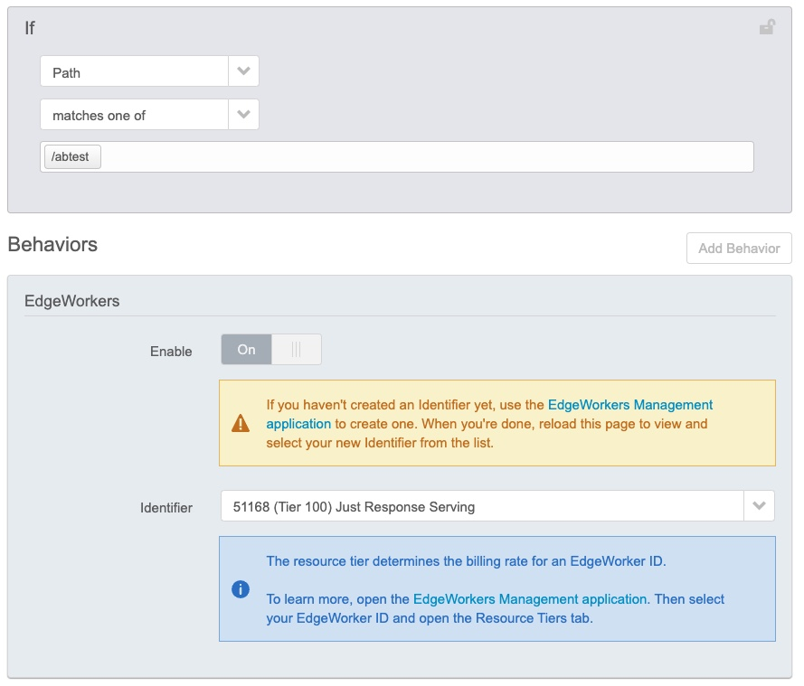

# CohortBasedRecommendation
One of the key strategy for the success of eCommerce Provisers is to provide the relevant recommendations to the users to keep them enagaged. While recommendations can vary individually, it becomes very difficult to implement recommdendations per user. Very often users are bucketed to one of the cohorts based on the various factors like age,gender,interests,geography,history,patterns etc. There are many ways cohort information of an user can be mapped to.
- Client making an additional ajax call to get the cohort mapping and then presenting the cohort information to the server for optimal recommendations
- Server taking the userId and making a call to Cohort Server to get the cohort Id and then presentingthe most optimal recommendtations.
CohortMapping at [Edgeworkers](https://techdocs.akamai.com/edgeworkers/docs/welcome-to-edgeworkers) is aimed to solve the client side additional overhead of cohort mapping and moving the logic to Akamai Edge.

### Existing Workflow


### Akamai Edgeworker Workflow


### Prerequisite
Get the Group Id of the config and use it while creating edgeworker
Akamai CLI Installation(https://github.com/akamai/cli). 
```
brew install akamai

akamai install edgeworkers

akamai edgeworkers register --resourceTierId 200 117225 DemoEW

```


### Configure the EW Behavior
Add the Edgeworker behavior in the Delivery Config based on necessary match conditions.



### Create Edgeworker and Upload the Bundle

```
tar -czvf cohortmapping.tgz main.js bundle.json

akamai edgeworkers upload --bundle cohortmapping.tgz 6424

akamai edgeworkers activate 6424 STAGING 2.0

akamai edgeworkers activate 6424 PRODUCTION 2.0
```

### Testing 
```
[~]$:http https://product.achuth.tech?userId=3456
HTTP/1.1 200 OK
Cache-Control: max-age=0, no-cache, no-store
CohortResponse1: 4
CohortResponse2: TestResponse
Connection: keep-alive
Content-Length: 63
Content-Type: application/json
Date: Mon, 18 Jul 2022 11:47:17 GMT
Expires: Mon, 18 Jul 2022 11:47:17 GMT
Pragma: no-cache
X-Akamai-Staging: ESSL
X-Hello-World: From Akamai EdgeWorkers Modifying the Origin

{
    "products": [
        "shoes",
        "socks",
        "sandals"
    ]
}
```
